# Telegram Bot Architecture for University Schedule

## Project Structure

```
tgbot_chelgu/
├── bot.py                 # Main bot application
├── config.py              # Configuration settings
├── database/
│   ├── __init__.py
│   ├── models.py          # Database models
│   └── connection.py      # Database connection logic
├── handlers/
│   ├── __init__.py
│   ├── start.py           # Start command handler
│   └── schedule.py        # Schedule navigation handlers
├── keyboards/
│   ├── __init__.py
│   └── navigation.py      # Inline keyboards for navigation
├── utils/
│   ├── __init__.py
│   └── schedule_utils.py  # Schedule formatting utilities
├── data/
│   └── schedule.json      # Sample schedule data (for development)
├── requirements.txt       # Python dependencies
└── README.md             # Project documentation
```

## Database Schema


## Bot Flow

```mermaid
graph TD
    A[User sends /start] --> B[Send welcome message]
    B --> C[Display current week schedule with navigation buttons]
    
    D[User clicks ← Previous Week] --> E[Calculate previous week dates]
    E --> F[Query database for schedule]
    F --> G[Format and send schedule message]
    
    H[User clicks 🏠 Current Week] --> I[Calculate current week dates]
    I --> J[Query database for schedule]
    J --> K[Format and send schedule message]
    
    L[User clicks → Next Week] --> M[Calculate next week dates]
    M --> N[Query database for schedule]
    N --> O[Format and send schedule message]
```



## Components Description

### 1. Main Bot (bot.py)
- Initializes the bot with aiogram
- Registers all handlers
- Starts the polling process

### 2. Database Layer
- Uses SQLite for data storage
- Models for groups, schedules, lessons, teachers, and subjects
- Connection management

### 3. Handlers
- `/start` command handler
- Callback query handlers for navigation buttons
- Message handlers for any additional commands

### 4. Keyboards
- Inline keyboard markup for navigation
- Button callbacks for previous, current, and next week

### 5. Utilities
- Date calculation functions
- Schedule formatting functions
- Week calculation utilities

## Technologies Used

- **Python 3.8+**: Main programming language
- **aiogram**: Telegram Bot API framework
- **SQLite**: Database for storing schedule data
- **python-dotenv**: Environment variable management

## Data Format

The schedule data will be stored in a structured format that allows for easy querying by group and week. Each lesson will have:
- Group information
- Date and time
- Subject
- Teacher
- Location

## Navigation Implementation

The navigation will be implemented using inline keyboards with callback queries:
- Callback data will contain the action and week offset
- Previous week: `{"action": "prev", "offset": -1}`
- Current week: `{"action": "current", "offset": 0}`
- Next week: `{"action": "next", "offset": 1}`